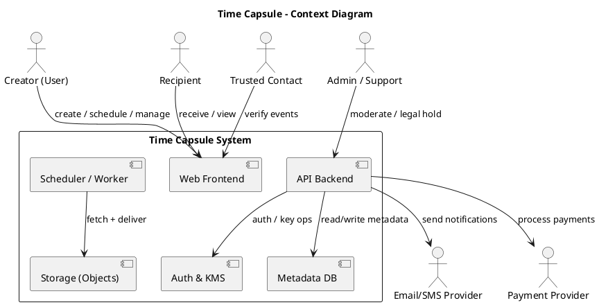
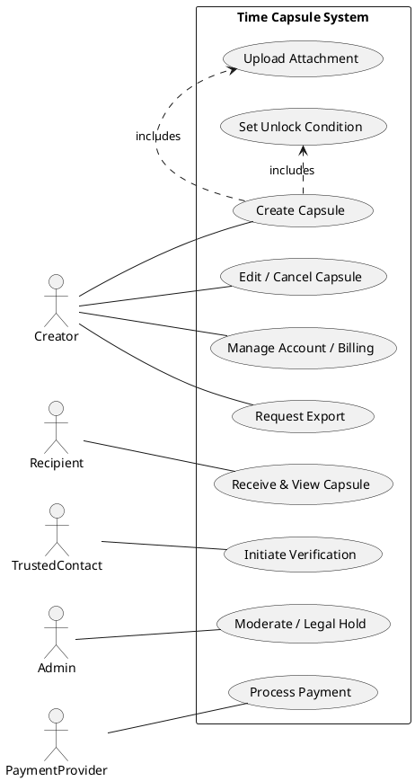
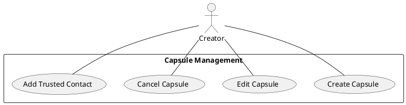
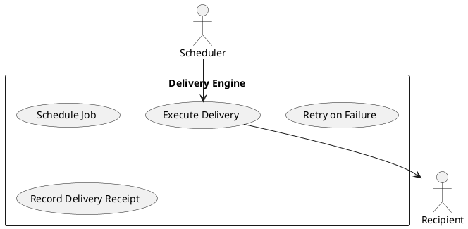
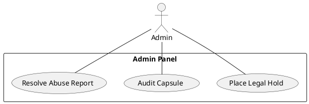
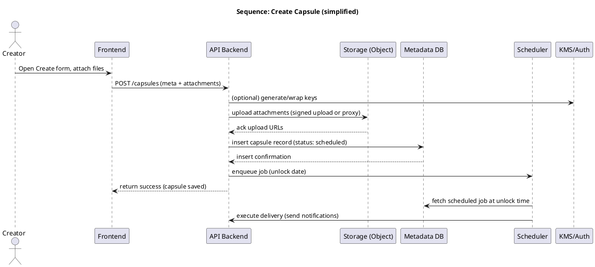
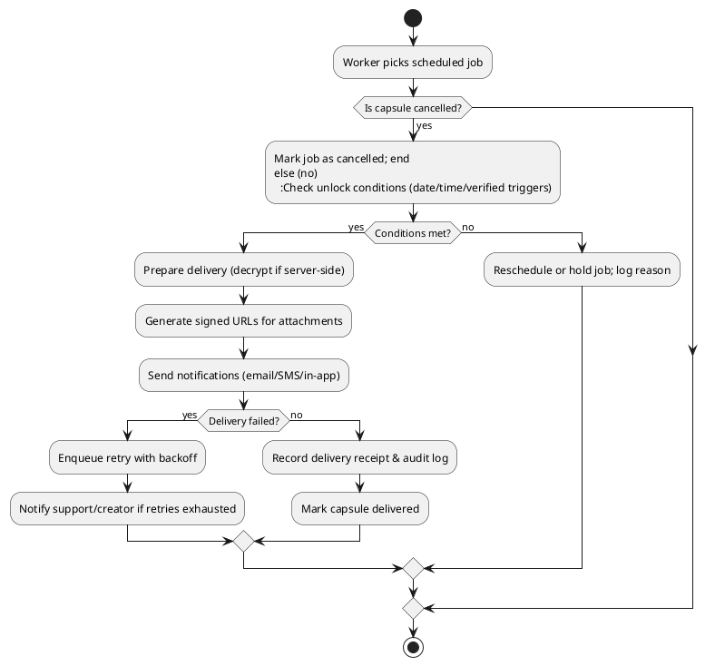
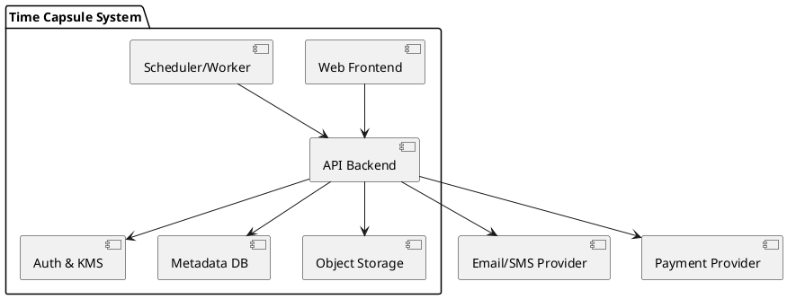
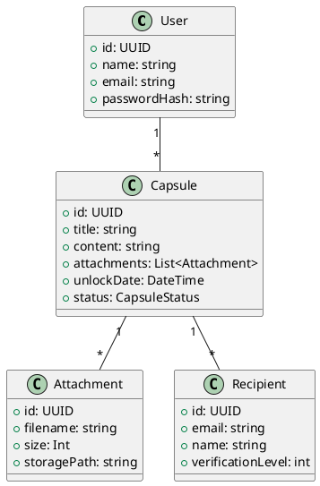

# Assignment 2 — SRS Extension: System Modeling & Documentation
Project: Time Capsule (digital tool for storing letters, photos, or messages that unlock at future dates)  
Author: Ali Rizwan (replace placeholder roll number)  
Date: 2025-11-21

---

Contents
1. Introduction and Background  
  1.1 Product (Problem Statement)  
  1.2 Background  
  1.3 Scope  
  1.4 Objectives / Aims / Targets  
  1.5 Challenges  
  1.6 Learning Outcomes  
  1.7 Nature of End Product  
  1.8 Completeness Criteria  
  1.9 Business Goals  
  1.10 Related Work / Literature Survey  
  1.11 Document Conventions

2. Required Diagrams (context, use cases, sequence, activity, SRS diagrams)  
  2.1 Context Diagram  
  2.2 Use Case Diagrams (holistic + per-module)  
  2.3 Sequence Diagram (major use case)  
  2.4 Activity Diagram (major workflow)  
  2.5 SRS Diagrams (Component & Class diagrams)

3. Appendices: Glossary, Assumptions, References

---

1. Introduction and Background

1.1 Product (Problem Statement)  
Time Capsule is a secure web application that allows users to create, store, and schedule delivery of digital messages, letters, and media that automatically unlock at future dates or upon verified conditions (for example: graduation, anniversaries, or trusted‑contact verification). Current ad‑hoc solutions (email drafts, saving files in cloud folders) lack scheduled, private delivery with strong integrity guarantees and easy multi‑recipient workflows. Time Capsule fills this gap with scheduled release, privacy options (including optional client‑side encryption), reliable delivery engine and audit trail.

1.2 Background (Domain & Environment)  
Domain: Personal archiving / digital legacy / event‑driven messaging.  
Operating environment: Web application (desktop + mobile browsers), optional native mobile apps. Backend services run on cloud infrastructure (AWS/GCP/Azure) including object storage for media, relational DB for metadata, and background worker/queue systems for scheduling deliveries. Integrations: email/SMS providers, payment/billing provider, optional notarization or third‑party verification services.

1.3 Scope (What this SRS covers)
Included:
- User account management (signup, login, email verification).
- Capsule creation (rich text + attachments), scheduling, recipients, and storage.
- Delivery engine (scheduling, retries, notifications).
- Basic encryption at rest and in transit; optional client‑side encryption described as a supported mode.
- Admin tools for monitoring and legal hold.
- Billing and subscription basics for tiered storage and features.

Excluded (out of scope for this SRS / MVP):
- Full enterprise integrations (LDAP/SSO) — may be a future extension.
- Blockchain anchoring and advanced notarization workflows (described as optional paid features, out of MVP scope).
- Offline mobile-only workflows (mobile apps optional, not required for MVP).
- Advanced multimedia editing/transcoding beyond basic preview and storage.

1.4 Objectives / Aims / Targets
- Deliver an MVP enabling a user to sign up, create a capsule, schedule an unlock date and deliver to recipient(s).
- Provide secure storage and secure delivery with audit logging.
- Ensure scheduled delivery reliability with retry and alert mechanisms (SLO: 99% successful first‑attempt deliveries in test window).
- Demonstrate privacy options including server‑side encryption; document client‑side encryption feasibility and key recovery options.
- Produce developer documentation, test cases, and runbooks for operations.

1.5 Challenges
- Time‑accurate scheduling (timezones, DST, and off‑by‑one date issues).
- Key management for optional client‑side E2E encryption and secure recovery without compromising privacy.
- Storage growth and cost management for large attachments retained long term.
- Handling legal/abuse/forensic requests while preserving privacy and compliance.
- Reliable delivery (email/SMS provider limitations, bouncing addresses).
- UX for long‑term content (informing users about irrecoverability when they choose E2E encryption).

1.6 Learning Outcomes
By completing this project you will learn:
- SRS writing and requirement management for a socio‑technical product.
- System modeling using UML (context, use case, sequence, activity diagrams).
- Architectural design of cloud services (storage, queueing, background workers).
- Security considerations for privacy‑preserving apps (E2E, KMS).
- Operational practices for scheduled job systems and monitoring.

1.7 Nature of End Product
- Deliverable: Working prototype (web application) implementing core flows (create → schedule → unlock/deliver) with documentation and diagrams. The deliverable is a demonstrable MVP; not a polished commercial product.

1.8 Completeness Criteria (how evaluators will judge completeness)
- All core functional requirements are implemented and demonstrable:
  - Signup/login, create capsule with attachments, configure recipients/unlock date, scheduled unlock and delivery, view audit/logs.
- Technical documentation and UML models included and consistent with implemented flow.
- Basic security features (TLS, server‑side encryption) implemented; optional E2E design described and prototype or simulation provided.
- Test evidence (unit/integration tests, manual test steps) for core flows.
- Readme and deployment/run instructions for the prototype.
- The delivered artifact is packaged as a local deployable or hosted demo with access instructions.

1.9 Business Goals
- Offer a trustworthy, private place for future messages to individuals and institutions (universities, legal firms).
- Monetize via freemium model: limited free tier, paid plans for higher storage, notarization, and enterprise SLAs.
- Provide institutional licensing to universities, event planners, and legal entities for secure scheduled messaging.
- Build brand trust around privacy and reliable long‑term delivery.

1.10 Related Work / Literature Survey (brief)
- Existing alternatives: mailbox / scheduled email services (boomerang), cloud storage (Google Drive, Dropbox), “futureme.org” (simple scheduled emails), and legacy planning services. These solutions miss integrated storage + multi‑recipient scheduling + strong client‑side encryption + audit trails.
- Research/standards: GDPR/CCPA compliance practices, WebCrypto APIs for client encryption, job queue reliability patterns (e.g., persistent queues, dead‑letter queues), and best practices for time‑based job scheduling in distributed systems.

1.11 Document Conventions
- Font/format: use consistent Markdown with headings. In Word/PDF deliverable use standard fonts (Arial / Calibri) and numbering as used above.
- UML: diagrams presented using PlantUML source for reproducibility.
- Terms:
  - Capsule: a scheduled message package (message + attachments + metadata).
  - Creator: user who creates a capsule.
  - Recipient: user who will receive the unlocked content.
  - Unlock: the event (date/time/condition) that allows a capsule to be delivered.
  - E2E: end‑to‑end encryption (optional client‑side).
- Icons: [!] for warnings, [i] for notes. Code and PlantUML blocks are fenced with triple/backticks or PlantUML fences.

---

2. Required Diagrams

Notes on rendering: Each diagram is provided as PlantUML source. You may render them using an online PlantUML server, the PlantUML VSCode extension, or copy them into a PlantUML editor to produce PNG/SVG for inclusion in the final Word/PDF.

2.1 Context Diagram (high level)
- External entities: Creator (User), Recipient, Trusted Contact, Email/SMS Provider, Payment Provider, Admin/Support

PlantUML source (context diagram):

2.2 Use Case Diagrams

2.2.1 Holistic Use Case Diagram (entire system)
Key actors: Creator, Recipient, TrustedContact, Admin, PaymentProvider

PlantUML source:

2.2.2 Use Case Diagram per Major Functionality
A) Capsule Management (Create/Edit/Cancel)

B) Delivery & Scheduling

C) Admin & Compliance

2.3 Sequence Diagram
Major use case: UC-01 Create a Capsule (simplified sequence)

PlantUML source:

2.4 Activity Diagram
Major workflow: Delivery Execution (what happens when unlock time arrives)

PlantUML source:

2.5 SRS Diagrams (Component & Class diagrams)

PlantUML source — Component Diagram:

PlantUML source — Class Diagram (simplified main domain classes):

---

3. Appendices

3.1 Glossary
- Capsule, Creator, Recipient, Unlock, E2E, KMS, SLO, TTL, Audit log — as defined earlier.

3.2 Assumptions
- Users have reliable email addresses; phone numbers optional.
- Cloud provider supports required services (object store, KMS, queues).
- Basic legal review available before public launch.

3.3 References
- GDPR & CCPA guidance, WebCrypto API docs, BullMQ / Redis docs (scheduling patterns), relevant academic papers on digital legacy & time capsule design, and the original memorae-clone- repo (TypeScript/React).

---

Export / Submission Instructions
- To submit as Word or PDF:
  1. Render the PlantUML diagrams to PNG/SVG (use PlantUML server or local extension) and insert images into the document.
  2. Copy the markdown into a Word document or export via a markdown-to-docx converter, include rendered diagrams in appropriate sections.
  3. Save using the required file name format: RollNumber_Name_Assignment (e.g., 123456_AliRizwan_Assignment2.docx or .pdf).
- If you'd like, I can:
  - Render the PlantUML diagrams to images for you, and generate a downloadable Word/PDF (if you grant permission to save to your repo), or
  - Commit the markdown + PlantUML sources into your repository as branch + PR, then you can download and convert locally.

---

Prepared by: Ali Rizwan  
Date: 2025-11-21